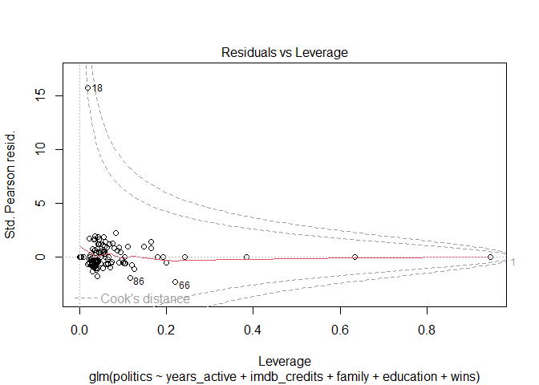
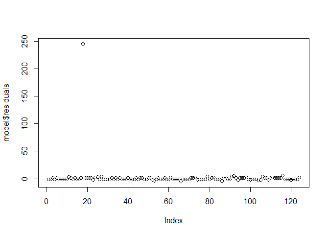
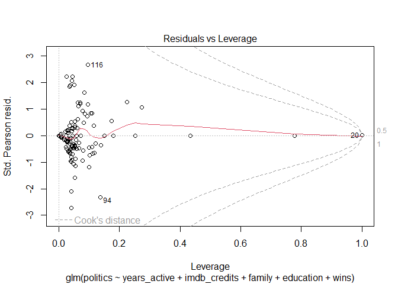
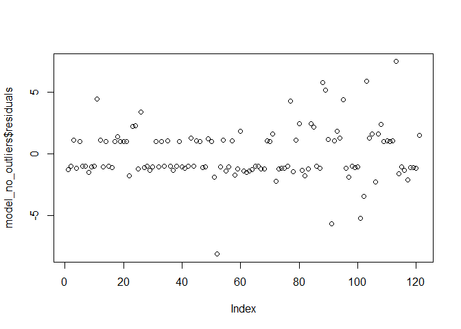
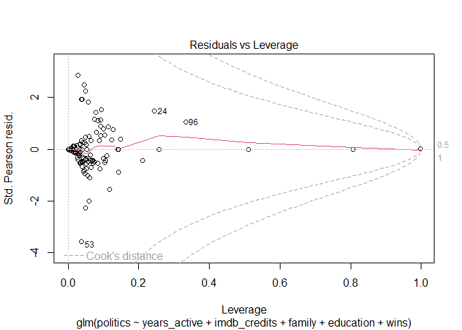
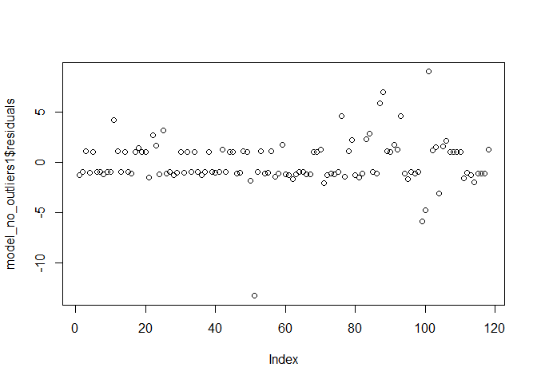

APM1205_FINALS_Code
================
BAYBAYON, DARLYN ANTOINETTE B.; MAYOL, JOSE RAPHAEL J.
2025-05-15

# Dataset

``` r
df <- read.csv("celebrity_df_2.csv")
head(df)
```

    ##              name years_active imdb_credits family education politics famas_wsp
    ## 1  Ian Veneracion           43           99      0         1        0         0
    ## 2   Nadine Lustre           24           47      0         1        0         3
    ## 3      Lito Lapid           57          146      1         1        1         0
    ## 4     Bembol Roco           55          225      0         2        0         1
    ## 5    Bong Revilla           42          100      6         4        1         1
    ## 6 Maricel Soriano           54          151      1         2        0         3
    ##   gawad_wsp mmff_wsp wins
    ## 1         0        1    1
    ## 2         1        1    5
    ## 3         0        0    0
    ## 4         1        0    2
    ## 5         0        1    2
    ## 6         0        5    8

## Removal of Unneeded Columns

``` r
df <- subset(df, select = -c(famas_wsp,gawad_wsp,mmff_wsp))
head(df)
```

    ##              name years_active imdb_credits family education politics wins
    ## 1  Ian Veneracion           43           99      0         1        0    1
    ## 2   Nadine Lustre           24           47      0         1        0    5
    ## 3      Lito Lapid           57          146      1         1        1    0
    ## 4     Bembol Roco           55          225      0         2        0    2
    ## 5    Bong Revilla           42          100      6         4        1    2
    ## 6 Maricel Soriano           54          151      1         2        0    8

``` r
library(tidyverse)
```

    ## ── Attaching core tidyverse packages ──────────────────────── tidyverse 2.0.0 ──
    ## ✔ dplyr     1.1.4     ✔ readr     2.1.5
    ## ✔ forcats   1.0.0     ✔ stringr   1.5.1
    ## ✔ ggplot2   3.5.1     ✔ tibble    3.2.1
    ## ✔ lubridate 1.9.4     ✔ tidyr     1.3.1
    ## ✔ purrr     1.0.2     
    ## ── Conflicts ────────────────────────────────────────── tidyverse_conflicts() ──
    ## ✖ dplyr::filter() masks stats::filter()
    ## ✖ dplyr::lag()    masks stats::lag()
    ## ℹ Use the conflicted package (<http://conflicted.r-lib.org/>) to force all conflicts to become errors

``` r
library(car)
```

    ## Warning: package 'car' was built under R version 4.4.3

    ## Loading required package: carData

    ## Warning: package 'carData' was built under R version 4.4.3

    ## 
    ## Attaching package: 'car'
    ## 
    ## The following object is masked from 'package:dplyr':
    ## 
    ##     recode
    ## 
    ## The following object is masked from 'package:purrr':
    ## 
    ##     some

## Addresing NA Values

``` r
df %>%
  summarise_all(~sum(is.na(.)))
```

    ##   name years_active imdb_credits family education politics wins
    ## 1    0            0            0      0        10        0    0

``` r
df <- df %>%
  mutate(education = ifelse(is.na(education), median(education, na.rm = TRUE), education))
```

``` r
df %>%
  summarise_all(~sum(is.na(.)))
```

    ##   name years_active imdb_credits family education politics wins
    ## 1    0            0            0      0         0        0    0

## Converting *education* to factor

``` r
df$education <- as.factor(df$education)
```

# Model 1 (Original)

## Model Fitting

``` r
model <- glm(politics~years_active+imdb_credits+family+education+wins, family="binomial", data=df)
summary(model)
```

    ## 
    ## Call:
    ## glm(formula = politics ~ years_active + imdb_credits + family + 
    ##     education + wins, family = "binomial", data = df)
    ## 
    ## Coefficients:
    ##                Estimate Std. Error z value Pr(>|z|)   
    ## (Intercept)  -2.025e+01  2.669e+03  -0.008  0.99395   
    ## years_active  6.524e-02  2.782e-02   2.345  0.01901 * 
    ## imdb_credits -1.116e-02  6.869e-03  -1.624  0.10431   
    ## family        9.438e-01  3.052e-01   3.092  0.00199 **
    ## education1    1.773e+01  2.669e+03   0.007  0.99470   
    ## education2    1.866e+01  2.669e+03   0.007  0.99442   
    ## education3    3.593e+01  3.585e+03   0.010  0.99200   
    ## education4    3.924e+01  3.327e+03   0.012  0.99059   
    ## wins         -3.392e-01  1.775e-01  -1.910  0.05609 . 
    ## ---
    ## Signif. codes:  0 '***' 0.001 '**' 0.01 '*' 0.05 '.' 0.1 ' ' 1
    ## 
    ## (Dispersion parameter for binomial family taken to be 1)
    ## 
    ##     Null deviance: 168.66  on 123  degrees of freedom
    ## Residual deviance: 109.70  on 115  degrees of freedom
    ## AIC: 127.7
    ## 
    ## Number of Fisher Scoring iterations: 17

## McFadden’s pesudo R-squared

``` r
pscl::pR2(model)["McFadden"]
```

    ## fitting null model for pseudo-r2

    ##  McFadden 
    ## 0.3495584

## Check: No Multicollinearity

``` r
vif(model)
```

    ##                  GVIF Df GVIF^(1/(2*Df))
    ## years_active 1.988668  1        1.410202
    ## imdb_credits 1.975845  1        1.405648
    ## family       1.030599  1        1.015184
    ## education    1.033658  4        1.004147
    ## wins         1.286474  1        1.134228

## Check: No Extreme Outliers

``` r
plot(model,5)
```

<!-- -->

## Check: Independent Observations

``` r
plot(model$residuals)
```

<!-- -->

# Model 2 (first removal of outliers)

## Model Fitting

``` r
df_no_outliers <- df[-c(18, 66, 86), ]
model_no_outliers <- glm(politics ~ years_active + imdb_credits + family + education + wins, 
                         family = binomial, data = df_no_outliers)
```

    ## Warning: glm.fit: fitted probabilities numerically 0 or 1 occurred

``` r
summary(model_no_outliers)
```

    ## 
    ## Call:
    ## glm(formula = politics ~ years_active + imdb_credits + family + 
    ##     education + wins, family = binomial, data = df_no_outliers)
    ## 
    ## Coefficients:
    ##                Estimate Std. Error z value Pr(>|z|)    
    ## (Intercept)  -2.242e+01  4.133e+03  -0.005 0.995671    
    ## years_active  8.535e-02  3.340e-02   2.555 0.010614 *  
    ## imdb_credits -1.099e-02  8.494e-03  -1.294 0.195681    
    ## family        1.683e+00  4.638e-01   3.629 0.000284 ***
    ## education1    1.954e+01  4.133e+03   0.005 0.996227    
    ## education2    2.024e+01  4.133e+03   0.005 0.996093    
    ## education3    3.764e+01  5.581e+03   0.007 0.994619    
    ## education4    4.947e+01  4.913e+03   0.010 0.991966    
    ## wins         -9.110e-01  3.421e-01  -2.663 0.007739 ** 
    ## ---
    ## Signif. codes:  0 '***' 0.001 '**' 0.01 '*' 0.05 '.' 0.1 ' ' 1
    ## 
    ## (Dispersion parameter for binomial family taken to be 1)
    ## 
    ##     Null deviance: 164.75  on 120  degrees of freedom
    ## Residual deviance:  85.33  on 112  degrees of freedom
    ## AIC: 103.33
    ## 
    ## Number of Fisher Scoring iterations: 18

## Check: No Multicollinearity

``` r
vif(model_no_outliers)
```

    ##                  GVIF Df GVIF^(1/(2*Df))
    ## years_active 1.920399  1        1.385785
    ## imdb_credits 2.052554  1        1.432674
    ## family       1.070411  1        1.034606
    ## education    1.056778  4        1.006927
    ## wins         1.364284  1        1.168026

## Check: No Extreme Outliers

``` r
plot(model_no_outliers,5)
```

    ## Warning in sqrt(crit * p * (1 - hh)/hh): NaNs produced
    ## Warning in sqrt(crit * p * (1 - hh)/hh): NaNs produced

<!-- -->

## Check: Independent Observations

``` r
plot(model_no_outliers$residuals)
```

<!-- -->

## McFadden’s pesudo R-squared

``` r
pscl::pR2(model_no_outliers)["McFadden"]
```

    ## fitting null model for pseudo-r2

    ##  McFadden 
    ## 0.4820531

# Model 3 - Final (second removal of outliers)

## Model Fitting

``` r
df_no_outliers1 <- df[-c(18, 20, 66, 86, 94, 116), ]
model_no_outliers1 <- glm(politics ~ years_active + imdb_credits + family + education + wins, 
                         family = binomial, data = df_no_outliers1)
```

    ## Warning: glm.fit: fitted probabilities numerically 0 or 1 occurred

``` r
summary(model_no_outliers1)
```

    ## 
    ## Call:
    ## glm(formula = politics ~ years_active + imdb_credits + family + 
    ##     education + wins, family = binomial, data = df_no_outliers1)
    ## 
    ## Coefficients:
    ##                Estimate Std. Error z value Pr(>|z|)    
    ## (Intercept)   -21.68727 2425.75982  -0.009 0.992867    
    ## years_active    0.09013    0.03646   2.472 0.013441 *  
    ## imdb_credits   -0.01791    0.01018  -1.760 0.078337 .  
    ## family          2.12217    0.55867   3.799 0.000146 ***
    ## education1     19.25220 2425.75968   0.008 0.993668    
    ## education2     19.67544 2425.75964   0.008 0.993528    
    ## education3     35.60365 3295.98625   0.011 0.991381    
    ## education4     39.67097 3198.57518   0.012 0.990104    
    ## wins           -0.97875    0.38555  -2.539 0.011130 *  
    ## ---
    ## Signif. codes:  0 '***' 0.001 '**' 0.01 '*' 0.05 '.' 0.1 ' ' 1
    ## 
    ## (Dispersion parameter for binomial family taken to be 1)
    ## 
    ##     Null deviance: 160.176  on 117  degrees of freedom
    ## Residual deviance:  76.005  on 109  degrees of freedom
    ## AIC: 94.005
    ## 
    ## Number of Fisher Scoring iterations: 17

## Check: No Multicollinearity

``` r
vif(model_no_outliers1)
```

    ##                  GVIF Df GVIF^(1/(2*Df))
    ## years_active 1.974741  1        1.405255
    ## imdb_credits 2.041041  1        1.428650
    ## family       1.134300  1        1.065035
    ## education    1.063636  4        1.007741
    ## wins         1.392589  1        1.180080

## Check: No Extreme Outliers

``` r
plot(model_no_outliers1,5)
```

    ## Warning in sqrt(crit * p * (1 - hh)/hh): NaNs produced
    ## Warning in sqrt(crit * p * (1 - hh)/hh): NaNs produced

<!-- -->

## Check: Independent Observations

``` r
plot(model_no_outliers1$residuals)
```

<!-- -->

## McFadden’s pesudo R-squared

``` r
pscl::pR2(model_no_outliers1)["McFadden"]
```

    ## fitting null model for pseudo-r2

    ##  McFadden 
    ## 0.5254896

## Check: Linear Relation Between Explanatory Variables and Logit of the Response

``` r
df_no_outliers1$log_imdb <- log(df_no_outliers1$imdb_credits + 1) * df_no_outliers1$imdb_credits
df_no_outliers1$log_yrs <- log(df_no_outliers1$years_active + 1) * df_no_outliers1$years_active

box_tidwell_no_outliers1 <- glm(politics ~ years_active + log_yrs + imdb_credits + log_imdb + family + education + wins, 
                         family = binomial, data = df_no_outliers1)
```

    ## Warning: glm.fit: fitted probabilities numerically 0 or 1 occurred

``` r
summary(box_tidwell_no_outliers1)
```

    ## 
    ## Call:
    ## glm(formula = politics ~ years_active + log_yrs + imdb_credits + 
    ##     log_imdb + family + education + wins, family = binomial, 
    ##     data = df_no_outliers1)
    ## 
    ## Coefficients:
    ##                Estimate Std. Error z value Pr(>|z|)    
    ## (Intercept)   -18.15376 2389.03386  -0.008 0.993937    
    ## years_active   -0.32654    0.52031  -0.628 0.530282    
    ## log_yrs         0.09554    0.11914   0.802 0.422627    
    ## imdb_credits   -0.09949    0.10673  -0.932 0.351229    
    ## log_imdb        0.01485    0.01966   0.755 0.449969    
    ## family          2.15723    0.58296   3.700 0.000215 ***
    ## education1     19.22092 2389.03199   0.008 0.993581    
    ## education2     19.70713 2389.03194   0.008 0.993418    
    ## education3     35.84972 3249.80693   0.011 0.991198    
    ## education4     40.14880 3251.22302   0.012 0.990147    
    ## wins           -0.98671    0.39683  -2.486 0.012902 *  
    ## ---
    ## Signif. codes:  0 '***' 0.001 '**' 0.01 '*' 0.05 '.' 0.1 ' ' 1
    ## 
    ## (Dispersion parameter for binomial family taken to be 1)
    ## 
    ##     Null deviance: 160.176  on 117  degrees of freedom
    ## Residual deviance:  74.171  on 107  degrees of freedom
    ## AIC: 96.171
    ## 
    ## Number of Fisher Scoring iterations: 17

# Model Evaluation

## Prediction Column

``` r
df_test <- df_no_outliers1
df_test$predicted_prob <- predict(model_no_outliers1, type = "response")
```

``` r
df_test$predicted_class <- ifelse(df_test$predicted_prob > 0.45, 1, 0)
```

## Confusion Matrix

``` r
library(caret)
```

    ## Warning: package 'caret' was built under R version 4.4.3

    ## Loading required package: lattice

    ## 
    ## Attaching package: 'caret'

    ## The following object is masked from 'package:purrr':
    ## 
    ##     lift

``` r
conf_matrix <- confusionMatrix(factor(df_test$predicted_class), factor(df_test$politics))
conf_matrix
```

    ## Confusion Matrix and Statistics
    ## 
    ##           Reference
    ## Prediction  0  1
    ##          0 62 10
    ##          1  7 39
    ##                                           
    ##                Accuracy : 0.8559          
    ##                  95% CI : (0.7794, 0.9138)
    ##     No Information Rate : 0.5847          
    ##     P-Value [Acc > NIR] : 1.713e-10       
    ##                                           
    ##                   Kappa : 0.7007          
    ##                                           
    ##  Mcnemar's Test P-Value : 0.6276          
    ##                                           
    ##             Sensitivity : 0.8986          
    ##             Specificity : 0.7959          
    ##          Pos Pred Value : 0.8611          
    ##          Neg Pred Value : 0.8478          
    ##              Prevalence : 0.5847          
    ##          Detection Rate : 0.5254          
    ##    Detection Prevalence : 0.6102          
    ##       Balanced Accuracy : 0.8472          
    ##                                           
    ##        'Positive' Class : 0               
    ## 

# Testing

## Vilma

``` r
vilma <- data.frame(
  years_active = 62,
  imdb_credits = 231,
  family = 2,
  education = as.factor(4),
  wins = 18
)
vilma_prob <- predict(model_no_outliers1, vilma, type = "response")
vilma_class <- ifelse(vilma_prob > 0.45, 1, 0)
vilma_class
```

    ## 1 
    ## 1

## Bong Revilla (assume only HS graduate)

``` r
bong_hs <- data.frame(
  years_active = 42,
  imdb_credits = 100,
  family = 6,
  education = as.factor(1),
  wins = 2
)
bong_hs_prob <- predict(model_no_outliers1, bong_hs, type = "response")
bong_hs_class <- ifelse(bong_hs_prob > 0.45, 1, 0)
bong_hs_class
```

    ## 1 
    ## 1

## Coco Martin

``` r
coco <- data.frame(
  years_active = 24,
  imdb_credits = 66,
  family = 0,
  education = as.factor(2),
  wins = 1
)
coco_prob <- predict(model_no_outliers1, coco, type = "response")
coco_class <- ifelse(coco_prob > 0.45, 1, 0)
coco_class
```

    ## 1 
    ## 0

## Willie

``` r
wowowie <- data.frame(
  years_active = 38,
  imdb_credits = 38,
  family = 0,
  education = as.factor(0),
  wins = 0
)
wowowie_prob <- predict(model_no_outliers1, wowowie, type = "response")
wowowie_class <- ifelse(wowowie_prob > 0.45, 1, 0)
wowowie_class
```

    ## 1 
    ## 0

## Jolo Revilla

``` r
jolo <- data.frame(
  years_active = 19,
  imdb_credits = 19,
  family = 2,
  education = as.factor(2),
  wins = 0
)
jolo_prob <- predict(model_no_outliers1, jolo, type = "response")
jolo_class <- ifelse(jolo_prob > 0.45, 1, 0)
jolo_class
```

    ## 1 
    ## 1
